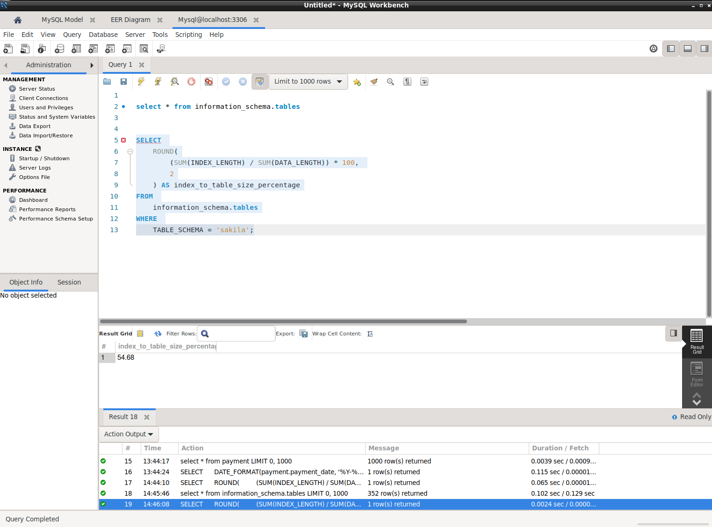

# Домашнее задание к занятию "`Индексы`" - `Чернецкий А.В.`


### Инструкция по выполнению домашнего задания

   1. Сделайте `fork` данного репозитория к себе в Github и переименуйте его по названию или номеру занятия, например, https://github.com/имя-вашего-репозитория/git-hw или  https://github.com/имя-вашего-репозитория/7-1-ansible-hw).
   2. Выполните клонирование данного репозитория к себе на ПК с помощью команды `git clone`.
   3. Выполните домашнее задание и заполните у себя локально этот файл README.md:
      - впишите вверху название занятия и вашу фамилию и имя
      - в каждом задании добавьте решение в требуемом виде (текст/код/скриншоты/ссылка)
      - для корректного добавления скриншотов воспользуйтесь [инструкцией "Как вставить скриншот в шаблон с решением](https://github.com/netology-code/sys-pattern-homework/blob/main/screen-instruction.md)
      - при оформлении используйте возможности языка разметки md (коротко об этом можно посмотреть в [инструкции  по MarkDown](https://github.com/netology-code/sys-pattern-homework/blob/main/md-instruction.md))
   4. После завершения работы над домашним заданием сделайте коммит (`git commit -m "comment"`) и отправьте его на Github (`git push origin`);
   5. Для проверки домашнего задания преподавателем в личном кабинете прикрепите и отправьте ссылку на решение в виде md-файла в вашем Github.
   6. Любые вопросы по выполнению заданий спрашивайте в чате учебной группы и/или в разделе “Вопросы по заданию” в личном кабинете.
   
Желаем успехов в выполнении домашнего задания!
   
### Дополнительные материалы, которые могут быть полезны для выполнения задания

1. [Руководство по оформлению Markdown файлов](https://gist.github.com/Jekins/2bf2d0638163f1294637#Code)


### Задание 1





```
SELECT 
    ROUND(
        (SUM(INDEX_LENGTH) / SUM(DATA_LENGTH)) * 100, 
        2
    ) AS index_to_table_size_percentage
FROM 
    information_schema.tables
WHERE 
    TABLE_SCHEMA = 'sakila';

```

### Задание 2

```
-> Table scan on <temporary>  (cost=2.5..2.5 rows=0) (actual time=22796..22797 rows=391 loops=1)
    -> Temporary table with deduplication  (cost=0..0 rows=0) (actual time=22796..22796 rows=391 loops=1)
        -> Window aggregate with buffering: sum(payment.amount) OVER (PARTITION BY c.customer_id,f.title )   (actual time=9361..21984 rows=642000 loops=1)
            -> Sort: c.customer_id, f.title  (actual time=9361..9624 rows=642000 loops=1)
                -> Stream results  (cost=10.2e+6 rows=16e+6) (actual time=2.17..6743 rows=642000 loops=1)
                    -> Nested loop inner join  (cost=10.2e+6 rows=16e+6) (actual time=2.15..5588 rows=642000 loops=1)
                        -> Nested loop inner join  (cost=8.59e+6 rows=16e+6) (actual time=2.14..4965 rows=642000 loops=1)
                            -> Nested loop inner join  (cost=6.99e+6 rows=16e+6) (actual time=2.13..4318 rows=642000 loops=1)
                                -> Inner hash join (no condition)  (cost=1.54e+6 rows=15.4e+6) (actual time=2.11..171 rows=634000 loops=1)
                                    -> Filter: (cast(p.payment_date as date) = '2005-07-30')  (cost=1.61 rows=15400) (actual time=1.07..24.6 rows=634 loops=1)
                                        -> Table scan on p  (cost=1.61 rows=15400) (actual time=1.04..17.9 rows=16044 loops=1)
                                    -> Hash
                                        -> Covering index scan on f using idx_title  (cost=103 rows=1000) (actual time=0.0691..0.78 rows=1000 loops=1)
                                -> Covering index lookup on r using rental_date (rental_date=p.payment_date)  (cost=0.25 rows=1.04) (actual time=0.00445..0.00614 rows=1.01 loops=634000)
                            -> Single-row index lookup on c using PRIMARY (customer_id=r.customer_id)  (cost=250e-6 rows=1) (actual time=558e-6..620e-6 rows=1 loops=642000)
                        -> Single-row covering index lookup on i using PRIMARY (inventory_id=r.inventory_id)  (cost=250e-6 rows=1) (actual time=489e-6..566e-6 rows=1 loops=642000)

```

1) Table scan on <temporary> (actual time=22796..22797 rows=391 loops=1)
Затратный скан временной таблицы
2) Temporary table with deduplication (actual time=22796..22796 rows=391 loops=1)
Временная таблица для удаления дублей записей
3) Window aggregate with buffering: sum(payment.amount) OVER (PARTITION BY c.customer_id,f.title )
(actual time=9361..21984 rows=642000 loops=1)
Оконные функции требуют временного хранения данных
4) Sort: c.customer_id, f.title (actual time=9361..9624 rows=642000 loops=1)
Затратная сортировка данных
5) Nested loop inner join (actual time=2.15..5588 rows=642000 loops=1)
Многократные вложенные циклы приводящие к временым затратам
6) Table scan on p (actual time=1.04..17.9 rows=16044 loops=1)
Полный скан таблицы

Оптимизированный запрос:
```
SELECT 
    CONCAT(c.last_name, ' ', c.first_name) AS full_name, 
    SUM(p.amount) AS total_amount
FROM 
    payment p
JOIN 
    rental r ON p.payment_date = r.rental_date
JOIN 
    customer c ON r.customer_id = c.customer_id
JOIN 
    inventory i ON i.inventory_id = r.inventory_id
JOIN 
    film f ON f.film_id = i.film_id
WHERE 
    DATE(p.payment_date) = '2005-07-30'
GROUP BY 
    c.customer_id, c.last_name, c.first_name, f.title
ORDER BY 
    full_name;

```
Создал индекс CREATE INDEX idx_payment_date ON payment (payment_date);

Поменял sql запрос:

```
EXPLAIN ANALYZE
SELECT 
    c.customer_id,
    f.title,
    SUM(p.amount) AS total_amount
FROM 
    payment p
INNER JOIN rental r ON r.rental_date = p.payment_date
INNER JOIN inventory i ON i.inventory_id = r.inventory_id
INNER JOIN film f ON f.film_id = i.film_id
INNER JOIN customer c ON c.customer_id = r.customer_id
WHERE 
    p.payment_date >= '2005-07-30' 
    AND p.payment_date < DATE_ADD('2005-07-30', INTERVAL 1 DAY)
GROUP BY 
    c.customer_id, f.title;

```
Индекс используется и стало побыстрей:

```

-> Table scan on <temporary>  (actual time=19.9..20.1 rows=634 loops=1)
    -> Aggregate using temporary table  (actual time=19.8..19.8 rows=634 loops=1)
        -> Nested loop inner join  (cost=1030 rows=661) (actual time=0.307..17.1 rows=642 loops=1)
            -> Nested loop inner join  (cost=805 rows=661) (actual time=0.299..14.5 rows=642 loops=1)
                -> Nested loop inner join  (cost=581 rows=661) (actual time=0.293..12.4 rows=642 loops=1)
                    -> Nested loop inner join  (cost=349 rows=634) (actual time=0.265..3.7 rows=634 loops=1)
                        -> Filter: ((r.rental_date >= TIMESTAMP'2005-07-30 00:00:00') and (r.rental_date < <cache>(('2005-07-30' + interval 1 day))))  (cost=127 rows=634) (actual time=0.253..1.44 rows=634 loops=1)
                            -> Covering index range scan on r using rental_date over ('2005-07-30 00:00:00' <= rental_date < '2005-07-31 00:00:00')  (cost=127 rows=634) (actual time=0.25..0.977 rows=634 loops=1)
                        -> Single-row covering index lookup on c using PRIMARY (customer_id=r.customer_id)  (cost=0.25 rows=1) (actual time=0.0031..0.00316 rows=1 loops=634)
                    -> Index lookup on p using idx_payment_date (payment_date=r.rental_date)  (cost=0.261 rows=1.04) (actual time=0.0116..0.0133 rows=1.01 loops=634)
                -> Single-row index lookup on i using PRIMARY (inventory_id=r.inventory_id)  (cost=0.24 rows=1) (actual time=0.00286..0.00294 rows=1 loops=642)
            -> Single-row index lookup on f using PRIMARY (film_id=i.film_id)  (cost=0.24 rows=1) (actual time=0.00348..0.00355 rows=1 loops=642)

```


